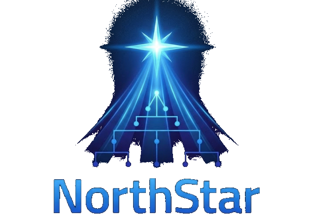
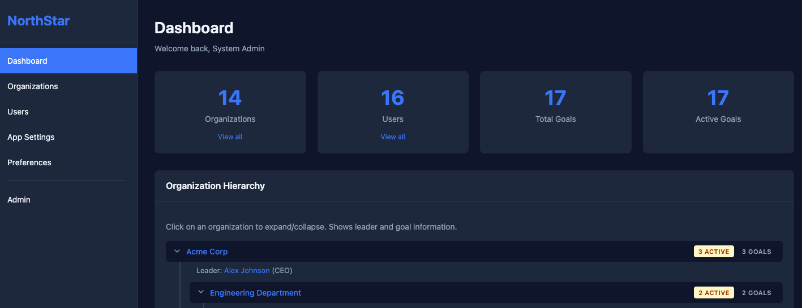
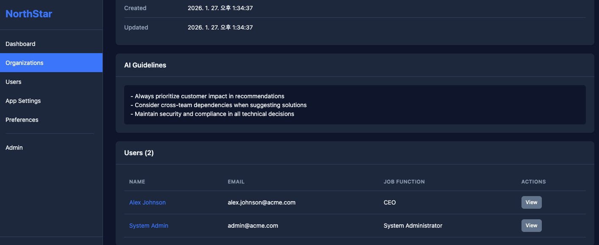
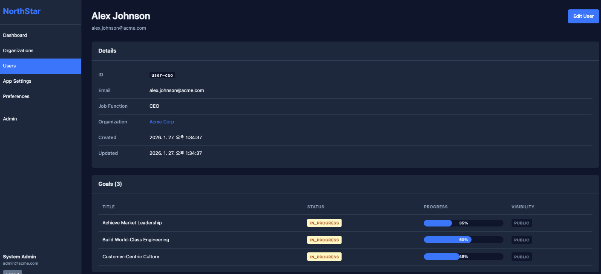

<p align="center">
  
</p>

# NorthStar

Define the organization's goals hierarchically and inject them into AI assistants through Model Context Protocol (MCP) to ensure that individual work aligns with the organization's direction.

## The Purpose Behind the Development

"I've been experimenting with 'Vibe coding' lately, and it’s fascinating how the same task can yield such different results depending on who's doing it. It made me wonder: even within the same organization, does everyone actually need different context to execute the same request? But surely, the organization's goals should be aligned, right? That train of thought led me to build this tool. I'm still testing its effectiveness, but the concept started there."

## Installation

```bash
# Clone the repository
git clone https://github.com/anthropics/NorthStar.git
cd NorthStar

# Install dependencies
npm install

# Build the project
npm run build

# Seed the database with example data
npm run seed
```

## Configuration

Create a `.env` file based on `.env.example`:

```bash
# User ID for the current session (required)
NORTHSTAR_USER_ID=user-jane-smith

# Database file path (optional, defaults to ./northstar.db)
NORTHSTAR_DB_PATH=./northstar.db
```

## Usage

### Starting the Server

```bash
NORTHSTAR_USER_ID=user-jane-smith npm start
```

### Using with Claude Desktop

Add to `~/Library/Application Support/Claude/claude_desktop_config.json`:

```json
{
  "mcpServers": {
    "northstar": {
      "command": "node",
      "args": ["/path/to/NorthStar/dist/index.js"],
      "env": {
        "NORTHSTAR_USER_ID": "user-jane-smith"
      }
    }
  }
}
```

### Using with Google Gemini

For Gemini clients that support MCP (like Gemini Developer API or compatible tools), use the standard server configuration:

```json
{
  "mcpServers": {
    "northstar": {
      "command": "node",
      "args": ["/path/to/NorthStar/dist/index.js"],
      "env": {
        "NORTHSTAR_USER_ID": "user-jane-smith"
      }
    }
  }
}
```

### Testing with MCP Inspector

```bash
NORTHSTAR_USER_ID=user-jane-smith npx @modelcontextprotocol/inspector node dist/index.js
```

## Screenshots

<p align="center">
  
  
  
</p>

## MCP Resources & Tools

### Resource

| URI | Description |
|-----|-------------|
| `northstar://context/current_user` | Returns user context with goals and AI guidelines |

### Tools

| Tool | Description |
|------|-------------|
| `get_parent_goals` | Get goals from parent organizations for strategic context |
| `search_collaborator_goals` | Search goals across accessible organizations |
| `submit_question` | Submit a question about a goal from another team |

## Available Scripts

| Script | Description |
|--------|-------------|
| `npm run build` | Compile TypeScript to JavaScript |
| `npm run start` | Start the MCP server |
| `npm run dev` | Build and start in one command |
| `npm run seed` | Populate database with example data |

## Sample Users

After running `npm run seed`, the following users are available:

| User ID | Name | Organization |
|---------|------|--------------|
| `user-jane-smith` | Jane Smith | Platform Team |
| `user-ceo` | Alex Johnson | Acme Corp |
| `user-vp-engineering` | Sarah Chen | Engineering Department |
| `user-platform-lead` | Mike Williams | Platform Team |
| `user-product-team-lead` | David Lee | Product Team |
| `user-enterprise-lead` | Amanda White | Enterprise Sales Team |

## Documentation

- [Architecture](docs/architecture/README.md)
- [Example Hierarchy](docs/architecture/example-hierarchy.md)

