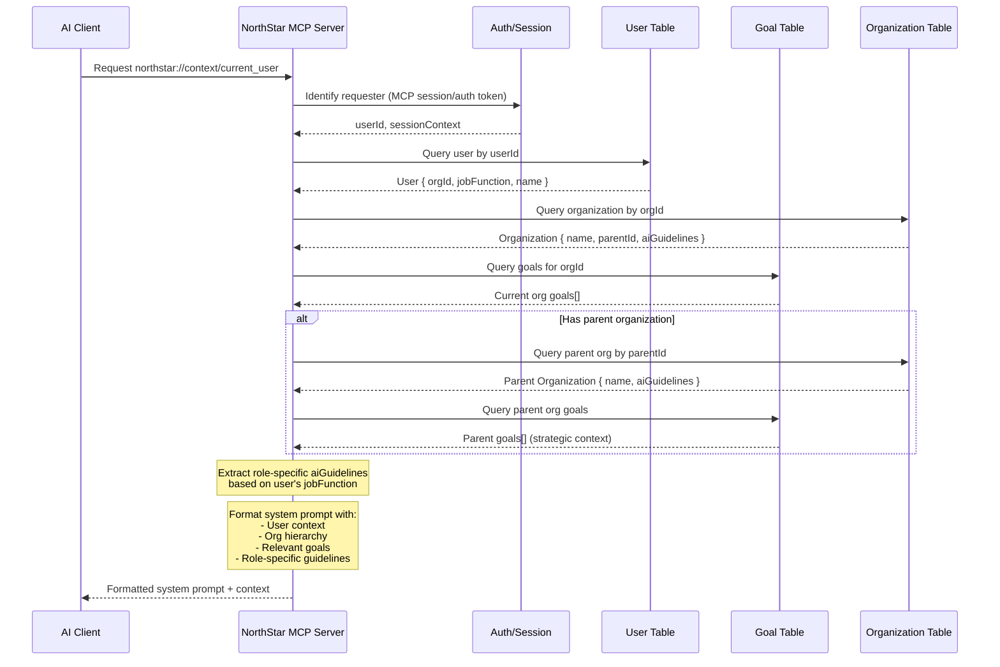
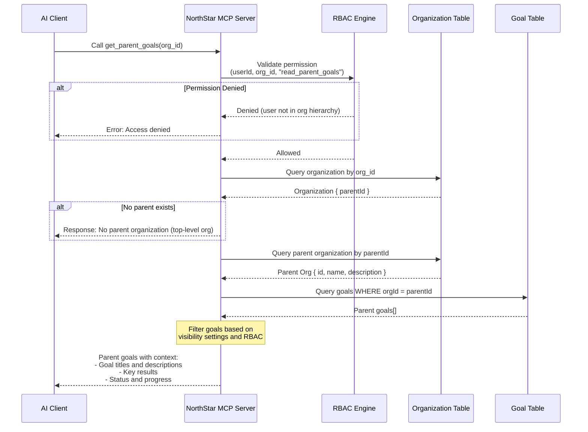
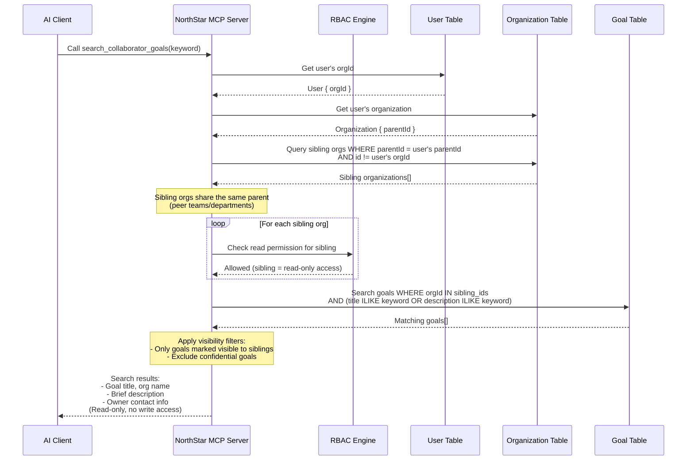
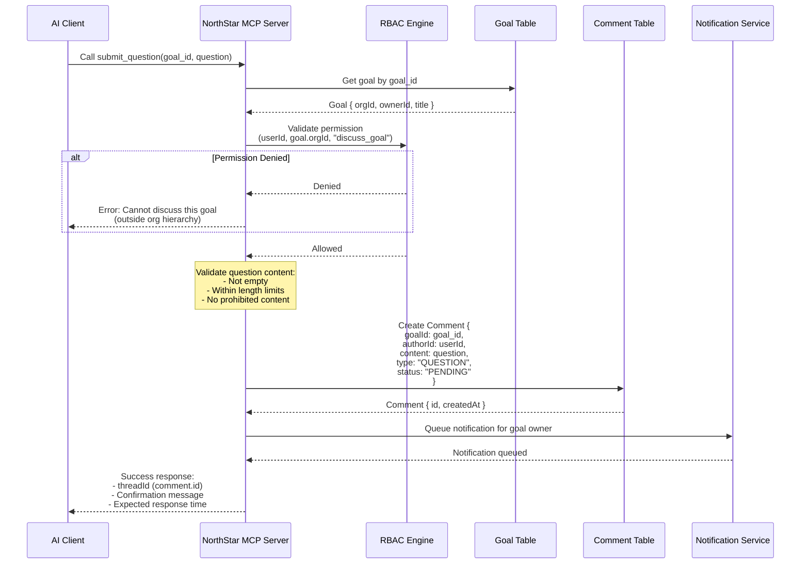
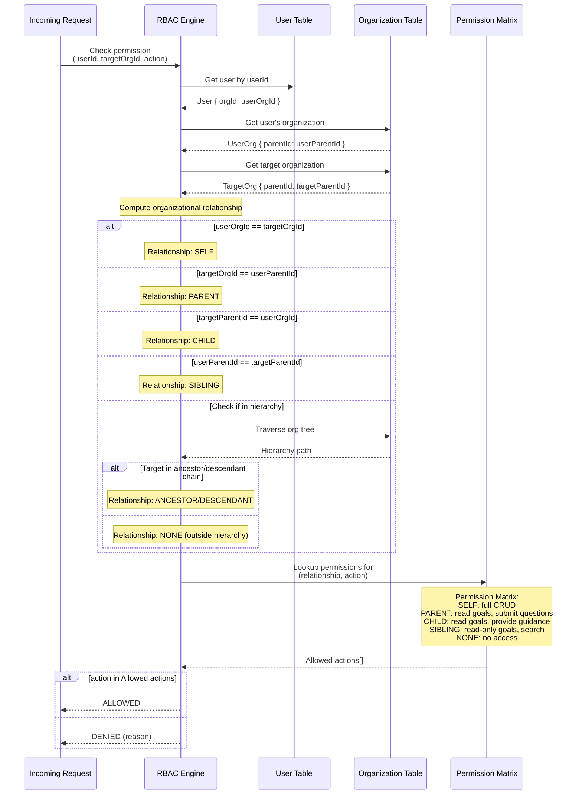

# NorthStar MCP Sequence Diagrams

This document contains sequence diagrams for the core MCP (Model Context Protocol) interaction flows in NorthStar. These diagrams illustrate how AI assistants interact with the NorthStar system to fetch organizational context, goals, and facilitate cross-organizational collaboration.

## Overview

NorthStar exposes its functionality through MCP, enabling AI assistants to:
- Fetch user-specific context and guidelines at conversation start
- Navigate organizational goal hierarchies
- Search for collaborator goals across sibling organizations
- Submit formal questions to goal owners
- Respect RBAC permissions throughout all interactions

---

## 1. MCP Resource Request Flow (`northstar://context/current_user`)

This diagram shows how AI assistants fetch user context at the start of a conversation. The resource provides the AI with organizational context, current goals, and role-specific guidelines.

**Key Points:**
- The AI receives a complete context package at conversation start
- Role-specific guidelines ensure the AI behaves appropriately for the user's job function
- Parent goal context provides strategic alignment

---

## 2. MCP Tool: `get_parent_goals(org_id)`

This diagram shows how an AI retrieves strategic context from a parent organization. This enables goal alignment discussions by understanding higher-level objectives.

**Key Points:**
- RBAC validation ensures users can only access goals within their organizational hierarchy
- Returns strategic goals that provide context for alignment discussions
- Top-level organizations receive an appropriate response indicating no parent exists

---

## 3. MCP Tool: `search_collaborator_goals(keyword)`

This diagram shows lateral visibility - how an AI can search for goals across peer (sibling) organizations to facilitate cross-team collaboration.

**Key Points:**
- Users can only search goals within sibling organizations (same parent)
- Results are read-only - no modification access to sibling goals
- Confidential goals are excluded from search results
- Enables discovery of collaboration opportunities

---

## 4. MCP Tool: `submit_question(goal_id, question)`

This diagram shows how an AI can draft and submit a formal question to a goal owner, creating a structured communication channel.

**Key Points:**
- Questions are stored as Comment records with type "QUESTION"
- RBAC ensures users can only ask questions about goals they have visibility into
- Goal owner receives notification about the new question
- Returns a thread ID for tracking the conversation

---

## 5. RBAC Permission Resolution

This diagram shows how permissions are dynamically determined based on organizational relationships. This is the core authorization logic used by all MCP tools.

**Permission Matrix Summary:**

| Relationship | Goals | Comments | Organization |
|-------------|-------|----------|--------------|
| **SELF** | Full CRUD | Full CRUD | Read, Update |
| **PARENT** | Read | Submit questions | Read |
| **CHILD** | Read, Comment | Read, Respond | Read |
| **SIBLING** | Read (visible only) | Submit questions | Read (basic) |
| **NONE** | No access | No access | No access |

**Key Points:**
- Relationship is computed dynamically based on org hierarchy
- Permission matrix maps relationships to allowed actions
- SELF always has full access to own organization's resources
- Siblings have limited, read-only lateral visibility
- Users outside the hierarchy have no access

---

## Integration Notes

### MCP Session Authentication
All requests include session context that identifies the requesting user. The NorthStar MCP server extracts the `userId` from the authenticated session before processing any request.

### Error Handling
All tools return structured error responses when:
- Authentication fails
- RBAC denies permission
- Requested resources don't exist
- Validation fails

### Caching Considerations
- User context can be cached per session
- Organizational hierarchy can be cached with TTL
- Goal data should be fetched fresh for accuracy
